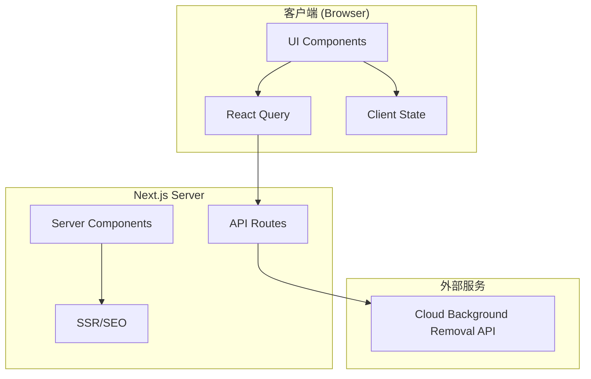

# Design Document - Background Removal System

## Overview

本设计文档描述了一个基于云服务的图片背景移除应用的技术架构和实现方案。应用使用Next.js 16构建，充分利用App Router、服务端组件(RSC)和客户端组件的优化策略。前端使用shadcn UI组件库和Framer Motion动画库，后端通过React Query和Axios与云端API通信。

### 核心功能

- 单张图片背景移除（本地文件、URL、拖拽上传）
- 批量图片背景移除
- 原图与处理后图片的滑块对比
- 处理后图片下载（单张/批量ZIP）

### 技术栈

- **框架**: Next.js 16 (App Router)
- **UI组件**: shadcn/ui
- **动画**: Framer Motion
- **状态管理**: React Query
- **HTTP客户端**: Axios
- **表单验证**: Zod + React Hook Form
- **样式**: Tailwind CSS 4
- **后端服务**: Supabase (Auth + Database + Storage)
- **安全验证**: Google reCAPTCHA v3
- **浏览器指纹**: FingerprintJS
- **错误监控**: Sentry

## Architecture



### 目录结构

```
app/
├── layout.tsx              # 根布局 (Server Component)
├── page.tsx                # 首页/Landing Page (Server Component)
├── globals.css             # 全局样式和主题颜色定义
├── (auth)/
│   ├── login/
│   │   └── page.tsx        # 登录页面
│   └── register/
│       └── page.tsx        # 注册页面
├── app/
│   └── page.tsx            # 背景移除应用页面
├── pricing/
│   └── page.tsx            # 定价页面
├── history/
│   └── page.tsx            # 处理历史页面
├── api/
│   ├── remove-bg/
│   │   └── route.ts        # 背景移除API路由
│   ├── auth/
│   │   └── callback/
│   │       └── route.ts    # Supabase OAuth回调
│   └── verify-captcha/
│       └── route.ts        # reCAPTCHA验证路由
│
components/
├── ui/                     # shadcn UI组件
│   ├── button.tsx
│   ├── tabs.tsx
│   ├── card.tsx
│   ├── input.tsx
│   └── ...
├── features/
│   ├── background-removal/
│   │   ├── image-uploader.tsx      # 图片上传组件
│   │   ├── url-input.tsx           # URL输入组件
│   │   ├── drop-zone.tsx           # 拖拽区域组件
│   │   ├── image-preview.tsx       # 图片预览组件
│   │   ├── image-comparison.tsx    # 图片对比滑块组件
│   │   ├── download-button.tsx     # 下载按钮组件
│   │   ├── batch-uploader.tsx      # 批量上传组件
│   │   ├── batch-progress.tsx      # 批量进度组件
│   │   ├── mode-switcher.tsx       # 模式切换Tab组件
│   │   └── processing-status.tsx   # 处理状态组件
│   ├── auth/
│   │   ├── login-form.tsx          # 登录表单
│   │   ├── register-form.tsx       # 注册表单
│   │   ├── user-menu.tsx           # 用户菜单
│   │   └── auth-guard.tsx          # 认证守卫组件
│   ├── history/
│   │   ├── history-list.tsx        # 历史列表组件
│   │   └── history-item.tsx        # 历史项组件
│   ├── landing/
│   │   ├── hero-section.tsx        # Hero区域组件
│   │   ├── features-section.tsx    # 功能展示组件
│   │   ├── how-it-works.tsx        # 使用流程组件
│   │   ├── testimonials.tsx        # 用户评价组件
│   │   └── cta-section.tsx         # 行动号召组件
│   └── pricing/
│       ├── pricing-card.tsx        # 定价卡片组件
│       ├── pricing-toggle.tsx      # 月付/年付切换组件
│       └── feature-list.tsx        # 功能列表组件
├── layout/
│   ├── header.tsx          # 页头组件 (含导航)
│   ├── footer.tsx          # 页脚组件
│   └── navbar.tsx          # 导航栏组件
└── providers/
    ├── query-provider.tsx  # React Query Provider
    ├── theme-provider.tsx  # 主题Provider
    └── auth-provider.tsx   # Supabase Auth Provider

lib/
├── supabase/
│   ├── client.ts           # Supabase客户端配置
│   ├── server.ts           # Supabase服务端配置
│   ├── middleware.ts       # Supabase中间件
│   └── types.ts            # 数据库类型定义
├── api/
│   ├── client.ts           # Axios实例配置
│   └── background-removal.ts # 背景移除API函数
├── hooks/
│   ├── use-background-removal.ts  # 背景移除mutation hook
│   ├── use-batch-removal.ts       # 批量处理hook
│   ├── use-file-validation.ts     # 文件验证hook
│   ├── use-auth.ts                # 认证hook
│   └── use-history.ts             # 历史记录hook
├── utils/
│   ├── cn.ts               # 类名合并工具 (clsx + tailwind-merge)
│   ├── file.ts             # 文件处理工具
│   ├── download.ts         # 下载工具
│   ├── validation.ts       # 验证工具
│   ├── fingerprint.ts      # 浏览器指纹工具
│   └── recaptcha.ts        # reCAPTCHA工具
├── monitoring/
│   └── sentry.ts           # Sentry错误监控配置
└── types/
    └── index.ts            # 类型定义

middleware.ts               # Next.js中间件 (认证检查)
```

## Components and Interfaces

### 1. ImageUploader (Client Component)

负责处理本地文件选择和拖拽上传。

```typescript
interface ImageUploaderProps {
  onImageSelect: (file: File) => void;
  onError: (error: string) => void;
  disabled?: boolean;
  maxSize?: number; // bytes, default 10MB
  acceptedFormats?: string[]; // default ['image/png', 'image/jpeg', 'image/webp']
}
```

### 2. UrlInput (Client Component)

处理URL输入和验证。

```typescript
interface UrlInputProps {
  onUrlSubmit: (url: string) => void;
  onError: (error: string) => void;
  disabled?: boolean;
}
```

### 3. DropZone (Client Component)

拖拽上传区域，包含视觉反馈。

```typescript
interface DropZoneProps {
  onDrop: (file: File) => void;
  onError: (error: string) => void;
  disabled?: boolean;
  isActive?: boolean;
  children?: React.ReactNode;
}
```

### 4. ImageComparison (Client Component)

使用第三方库实现的图片对比滑块组件。推荐使用 `react-compare-slider` 库。

```typescript
interface ImageComparisonProps {
  originalImage: string; // base64 or URL
  processedImage: string; // base64 or URL
  className?: string;
}
```

### 5. BatchUploader (Client Component)

批量上传组件，支持多文件选择。

```typescript
interface BatchUploaderProps {
  onFilesSelect: (files: File[]) => void;
  onError: (error: string) => void;
  disabled?: boolean;
  maxFiles?: number; // default 10
}
```

### 6. BatchProgress (Client Component)

显示批量处理进度。

```typescript
interface BatchProgressProps {
  items: BatchItem[];
  onRetry: (id: string) => void;
  onDownload: (id: string) => void;
  onDownloadAll: () => void;
}

interface BatchItem {
  id: string;
  filename: string;
  status: "pending" | "processing" | "completed" | "error";
  progress?: number;
  originalImage?: string;
  processedImage?: string;
  error?: string;
}
```

### 7. ModeSwitcher (Client Component)

单张/批量模式切换Tab。

```typescript
interface ModeSwitcherProps {
  mode: "single" | "batch";
  onModeChange: (mode: "single" | "batch") => void;
}
```

### 8. ProcessingStatus (Client Component)

处理状态显示组件。

```typescript
interface ProcessingStatusProps {
  status: "idle" | "processing" | "success" | "error";
  progress?: number;
  error?: string;
  onRetry?: () => void;
}
```

### 9. HeroSection (Server Component)

Landing Page的Hero区域，展示产品核心价值。

```typescript
interface HeroSectionProps {
  title: string;
  subtitle: string;
  ctaText: string;
  ctaHref: string;
}
```

### 10. FeaturesSection (Server Component)

功能展示区域，展示产品特性。

```typescript
interface Feature {
  icon: React.ReactNode;
  title: string;
  description: string;
}

interface FeaturesSectionProps {
  features: Feature[];
}
```

### 11. PricingCard (Client Component)

定价卡片组件。

```typescript
interface PricingPlan {
  id: string;
  name: string;
  description: string;
  monthlyPrice: number;
  annualPrice: number;
  features: string[];
  highlighted?: boolean;
  ctaText: string;
}

interface PricingCardProps {
  plan: PricingPlan;
  billingPeriod: "monthly" | "annual";
  onSelect: (planId: string) => void;
}
```

### 12. PricingToggle (Client Component)

月付/年付切换组件。

```typescript
interface PricingToggleProps {
  value: "monthly" | "annual";
  onChange: (value: "monthly" | "annual") => void;
  savingsPercentage?: number; // 年付节省百分比
}
```

## Data Models

### API Request/Response

```typescript
// 单张图片处理请求
interface RemoveBackgroundRequest {
  image: File | string; // File对象或URL
  captchaToken: string; // reCAPTCHA token
}

// 单张图片处理响应
interface RemoveBackgroundResponse {
  success: boolean;
  data?: {
    processedImage: string; // base64编码的PNG图片
    originalSize: { width: number; height: number };
    processedSize: { width: number; height: number };
    historyId?: string; // 历史记录ID (登录用户)
  };
  error?: {
    code: string;
    message: string;
  };
}

// 批量处理状态
interface BatchProcessingState {
  items: Map<string, BatchItem>;
  totalCount: number;
  completedCount: number;
  failedCount: number;
}
```

### Supabase数据库Schema

```sql
-- 用户使用记录表
CREATE TABLE usage_records (
  id UUID PRIMARY KEY DEFAULT gen_random_uuid(),
  user_id UUID REFERENCES auth.users(id),
  fingerprint TEXT, -- 浏览器指纹 (未登录用户)
  created_at TIMESTAMP WITH TIME ZONE DEFAULT NOW(),
  CONSTRAINT user_or_fingerprint CHECK (
    (user_id IS NOT NULL) OR (fingerprint IS NOT NULL)
  )
);

-- 处理历史表
CREATE TABLE processing_history (
  id UUID PRIMARY KEY DEFAULT gen_random_uuid(),
  user_id UUID REFERENCES auth.users(id) NOT NULL,
  original_image_url TEXT NOT NULL,
  processed_image_url TEXT NOT NULL,
  original_filename TEXT NOT NULL,
  file_size INTEGER NOT NULL,
  created_at TIMESTAMP WITH TIME ZONE DEFAULT NOW()
);

-- 创建索引
CREATE INDEX idx_usage_records_fingerprint ON usage_records(fingerprint);
CREATE INDEX idx_usage_records_user_id ON usage_records(user_id);
CREATE INDEX idx_processing_history_user_id ON processing_history(user_id);
```

### TypeScript类型定义

```typescript
// 用户类型
interface User {
  id: string;
  email: string;
  created_at: string;
}

// 使用记录
interface UsageRecord {
  id: string;
  user_id?: string;
  fingerprint?: string;
  created_at: string;
}

// 处理历史
interface ProcessingHistory {
  id: string;
  user_id: string;
  original_image_url: string;
  processed_image_url: string;
  original_filename: string;
  file_size: number;
  created_at: string;
}

// 使用限制检查结果
interface UsageLimitResult {
  canProcess: boolean;
  remainingCount: number;
  requiresLogin: boolean;
}
```

### 文件验证Schema

```typescript
import { z } from "zod";

const MAX_FILE_SIZE = 10 * 1024 * 1024; // 10MB
const ACCEPTED_IMAGE_TYPES = ["image/png", "image/jpeg", "image/jpg", "image/webp"];

export const fileValidationSchema = z.object({
  size: z.number().max(MAX_FILE_SIZE, "文件大小不能超过10MB"),
  type: z.enum(ACCEPTED_IMAGE_TYPES as [string, ...string[]], {
    errorMap: () => ({ message: "仅支持PNG、JPG、JPEG、WebP格式" }),
  }),
});

export const urlValidationSchema = z.string().url("请输入有效的URL地址");
```

## Correctness Properties

_A property is a characteristic or behavior that should hold true across all valid executions of a system-essentially, a formal statement about what the system should do. Properties serve as the bridge between human-readable specifications and machine-verifiable correctness guarantees._

Based on the prework analysis, the following correctness properties have been identified:

### Property 1: File Size Validation

_For any_ file submitted to the system, if the file size exceeds 10MB, the validation function SHALL return an error and reject the file.
**Validates: Requirements 1.3**

### Property 2: File Type Validation

_For any_ file submitted to the system (via selection or drag-and-drop), if the file MIME type is not in the accepted list (PNG, JPG, JPEG, WebP), the validation function SHALL return an error and reject the file.
**Validates: Requirements 1.4, 3.4**

### Property 3: URL Format Validation

_For any_ string submitted as a URL, if the string does not conform to valid URL format, the validation function SHALL return an error.
**Validates: Requirements 2.2**

### Property 4: Multiple File Drop Handling

_For any_ drop event containing multiple files, the system SHALL process only the first valid image file and ignore all subsequent files.
**Validates: Requirements 3.3**

### Property 5: Upload Controls Disabled During Processing

_For any_ processing state where status is 'processing', all upload controls (file input, URL input, drop zone) SHALL be disabled.
**Validates: Requirements 4.2**

### Property 6: Download Filename Generation

_For any_ original filename, the generated download filename SHALL follow the pattern: `{originalNameWithoutExtension}_no_bg.png`.
**Validates: Requirements 6.2**

### Property 7: Batch Queue Processing

_For any_ set of files uploaded in batch mode, all valid files SHALL be added to the processing queue with unique identifiers.
**Validates: Requirements 9.2**

### Property 8: Batch Error Isolation

_For any_ batch processing operation, if one image fails processing, the remaining images SHALL continue processing and the failed item SHALL be marked with error status.
**Validates: Requirements 9.5**

### Property 9: Guest Usage Limit

_For any_ browser fingerprint, the system SHALL allow exactly one free processing request before requiring login.
**Validates: Requirements 12.2, 12.3**

### Property 10: reCAPTCHA Verification Required

_For any_ image processing request, if the user does not have verified status, the request SHALL include a valid reCAPTCHA token.
**Validates: Requirements 13.1, 13.2**

### Property 11: History Record Creation

_For any_ successful image processing by a logged-in user, a history record SHALL be created with the correct user_id, image URLs, and timestamp.
**Validates: Requirements 14.1**

## Error Handling

### 错误类型

```typescript
enum ErrorCode {
  FILE_TOO_LARGE = "FILE_TOO_LARGE",
  INVALID_FILE_TYPE = "INVALID_FILE_TYPE",
  INVALID_URL = "INVALID_URL",
  NETWORK_ERROR = "NETWORK_ERROR",
  API_ERROR = "API_ERROR",
  DOWNLOAD_ERROR = "DOWNLOAD_ERROR",
  CAPTCHA_FAILED = "CAPTCHA_FAILED",
  USAGE_LIMIT_EXCEEDED = "USAGE_LIMIT_EXCEEDED",
  AUTH_REQUIRED = "AUTH_REQUIRED",
  SESSION_EXPIRED = "SESSION_EXPIRED",
}

interface AppError {
  code: ErrorCode;
  message: string;
  details?: unknown;
}
```

### 错误处理策略

1. **文件验证错误**: 立即显示toast通知，不发送API请求
2. **网络错误**: 显示错误toast，提供重试按钮
3. **API错误**: 解析API返回的错误信息，显示用户友好的错误消息
4. **批量处理错误**: 标记失败项，继续处理其他项，最终汇总显示

### Toast通知配置

使用 `sonner` 库实现toast通知：

```typescript
import { toast } from "sonner";

// 成功通知
toast.success("背景移除成功");

// 错误通知
toast.error("文件大小超过限制", {
  duration: 3000,
  action: {
    label: "重试",
    onClick: () => handleRetry(),
  },
});

// 加载通知
toast.loading("正在处理图片...");
```

Toast配置：

- 持续时间: 3秒自动消失
- 位置: 右下角
- 支持操作按钮（如重试）

### Sentry错误监控

集成Sentry进行生产环境错误监控：

```typescript
import * as Sentry from "@sentry/nextjs";

// 初始化配置
Sentry.init({
  dsn: process.env.NEXT_PUBLIC_SENTRY_DSN,
  environment: process.env.NODE_ENV,
  tracesSampleRate: 1.0,
});

// 捕获错误
Sentry.captureException(error);

// 添加上下文
Sentry.setContext("image_processing", {
  fileSize: file.size,
  fileType: file.type,
});
```

监控范围：

- API请求错误
- 文件处理错误
- 客户端运行时错误
- 性能追踪

## Testing Strategy

### 单元测试

使用Vitest进行单元测试，覆盖以下模块：

- 文件验证函数 (`lib/utils/validation.ts`)
- 文件名生成函数 (`lib/utils/download.ts`)
- API响应处理函数

### 属性测试

使用 `fast-check` 库进行属性测试，验证正确性属性：

```typescript
import * as fc from "fast-check";
```

每个属性测试配置运行至少100次迭代。

属性测试标注格式：

```typescript
// **Feature: background-removal, Property 1: File Size Validation**
// **Validates: Requirements 1.3**
```

### 组件测试

使用React Testing Library测试组件交互：

- 文件上传流程
- URL输入验证
- 拖拽上传
- 模式切换
- 批量处理流程

### E2E测试（可选）

使用Playwright进行端到端测试，覆盖完整用户流程。
